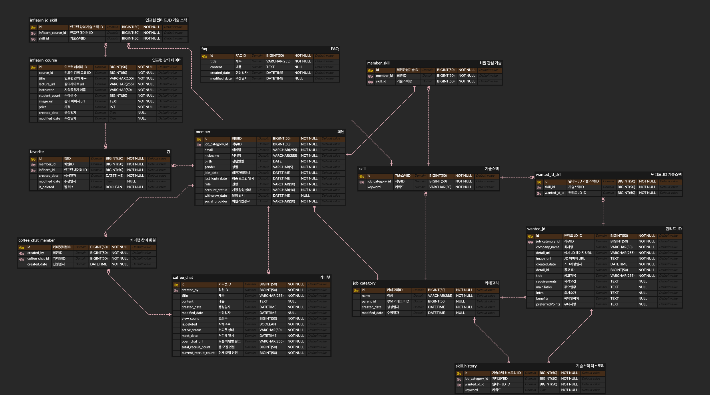

# f1-JDON

성장하고 싶은 개발자을 위한   

## 프로젝트 소개

원티드 JD 기반의 인기있는 기술스택 인프런 강의 추천
자유로운 커피챗

### JDON 미리 보기
| 메인페이지                                                                                                                                         | 기술 스택 검색 페이지                                                                                       |
|-----------------------------------------------------------------------------------------------------------------------------------------------|----------------------------------------------------------------------------------------------------|
|  |  |

| 커피챗 페이지                                                                                                         | 커피챗 상세 조회 페이지                                                                                                                  |
|-----------------------------------------------------------------------------------------------------------------|--------------------------------------------------------------------------------------------------------------------------------|
|  |  |

| 로그인 페이지                                                                                               | 마이페이지                                                                                              |
|-------------------------------------------------------------------------------------------------------|----------------------------------------------------------------------------------------------------|
|  |  |

### 기술 스택

#### Backend

    
<strong>Backend</strong>

    

         
        
        
    

    
<strong>Database</strong>

    

        
        
        
    

    
<strong>Others</strong>

    

        
    

### ERD

## Architecture

## Contributors

<table>
  <tbody>
    <tr>
    <td align="center">
        <a href="https://github.com/yoonseon12">
          
           <b>yoonseon12</b> 
        </a>
    </td>
    <td align="center">
        <a href="https://github.com/aqrms">
          
           <b>aqrms</b>
        </a>
         
    </td>
    <td align="center">
        <a href="https://github.com/aacara">
          
           <b>aacara</b> 
        </a>
    </td>
    <td align="center">
        <a href="https://github.com/anso33">
          
           <b>anso33</b>
        </a>
         
    </td>
    </tr>
    <tr>
        <td align="center">
        <b>원티드 크롤링</b>
        </td>
        <td align="center">
        <b>커피챗 서비스</b>
        </td>
        <td align="center">
        <b>인프런 크롤링</b>
        </td>
        <td align="center">
        <b>로그인 서비스</b>
        </td>
    </tr>
  </tbody>
</table>

