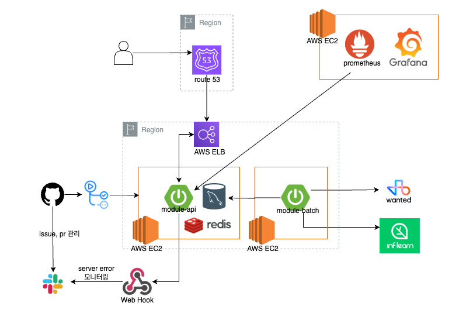

# 💡 JDON

인기있는 기술스택 키워드에 기반한 원티드 JD, 인프런 강의, 그리고 네트워킹을 한 곳에서!

## 📌 프로젝트 소개

**어떠한 기술스택** 으로 **어떠한 강의를** 학습해야하는지 고민하는 모든 개발자들을 위한, 개발자들의 네트워킹을 위한 서비스. **JDON**

### 📢 서비스 설명

- **인기 기술스택 기반 추천**
    - 원티드에서 수집한 JD를 기반으로 사용자에게 인기 기술스택을 추천합니다.
- **인프런 강의 연동**
    - 인프런에서 각 기술스택에 대한 실용적인 인기 강의를 수집하여 제공합니다.
- **개발자 커뮤니티**
    - JDON 회원을 위한 커피챗 서비스를 제공하여, 경험 공유와 네트워킹을 도모합니다.

### 🔍️ JDON 미리 보기

[JDON 바로가기](https://jdon.kr) 👉🏻 https://jdon.kr

#### JD-ON

| 목록 검색/조회                                                                                                             | 상세조회                                                                                                             | 리뷰                                                                                                                |
|----------------------------------------------------------------------------------------------------------------------|------------------------------------------------------------------------------------------------------------------|-------------------------------------------------------------------------------------------------------------------|
|  |  |  |
| 원티드에 게시된 JD를 필터 조건을 사용해서 조회할 수 있습니다.                                                                                 | JD의 상세 내용을 확인할 수 있습니다.                                                                                           | 각 JD에 대해 JDON 사용자가 작성한 리뷰를 확인할 수 있습니다.                                                                            |

#### 커피챗

| 오픈                                                                                                              | 신청                                                                                                              | 모아보기                                                                                                              |
|-----------------------------------------------------------------------------------------------------------------|-----------------------------------------------------------------------------------------------------------------|-------------------------------------------------------------------------------------------------------------------|
|  |  |  |
| JDON의 회원은 커피챗을 자유롭게 오픈할 수 있습니다.   커피챗을 오픈하기 위해서는 커피챗 진행 날짜, 시간, 모임 인원 그리고 커피챗 제목과 내용을 작성해야합니다.           | JDON의 회원은 커피챗을 자유롭게 참여할 수 있습니다.                                                                                 | JDON 회원이 자신이 오픈한 커피챗과 신청한 커피챗을 마이페이지에서 확인할 수 있습니다.                                                                |

#### 개인 서비스

| 기술 기반 인프런 강의 & JD 추천                                                                                                                         | 찜하기                                                                                                        |
|----------------------------------------------------------------------------------------------------------------------------------------------|------------------------------------------------------------------------------------------------------------|
|                             |  |
| 원티드에서 크롤링한 기술스택 키워드를 기반으로   관련된 인프런 인기 강의와 해당 기술에 관심을 가진 회사의  채용 공고(Job Description)를 제공합니다.  JDON의 회원이 아니어도 해당 서비스를 이용할 수 있습니다. | 개인화된 서비스를 제공하기 위해 강의 찜하기 기능을 제공합니다.   JDON의 회원에게 해당 서비스를 제공합니다.                                        |

#### 소셜 인증

| 로그인                                                                                                       | 회원가입                                                                                                       |
|-----------------------------------------------------------------------------------------------------------|------------------------------------------------------------------------------------------------------------|
|  |  |
| JDON은 카카오와 깃헙을 통해서 편리하게 로그인하실 수 있습니다.                                                                     | JDON은 카카오와 깃헙을 통해서 편리하게 회원가입하실 수 있습니다.                                                                     |

## 🗃️ 개발 기록

### ✨ 기술 스택

    
<strong>Backend</strong>

    

         
        
        
    

    
<strong>Database</strong>

    

        
        
        
    

    
<strong>Others</strong>

    

        
        
    

### 📦️ ERD

### 🏗️ Architecture

| Back-End                                           | 운영 & 개발 환경 구축                                |
|----------------------------------------------------|----------------------------------------------|
|  |  

## 👥 Contributors

<table>
  <tbody>
    <tr>
    <td align="center">
        <a href="https://github.com/yoonseon12">
          Leader  
          
            <b>yoonseon12</b> 
        </a>
    </td>
    <td align="center">
        <a href="https://github.com/aqrms">
           
          
           <b>aqrms</b>
        </a>
         
    </td>
    <td align="center">
        <a href="https://github.com/aacara">
           
          
           <b>aacara</b> 
        </a>
    </td>
    <td align="center">
        <a href="https://github.com/anso33">
           
          
           <b>anso33</b>
        </a>
         
    </td>
    </tr>
    <tr>
        <td align="center">
        <b>프로젝트 구조 및 아키텍처 도입</b>
         
        <b>원티드 크롤링 배치 스케줄러 구축</b>
        </td>
        <td align="center">
        <b>커피챗 서비스</b>
         
        <b>모니터링 환경 구축</b>
        </td>
        <td align="center">
        <b>인프런 크롤링 배치 스케줄러 구축</b>
         
        <b>기술스택 연관어 캐시 구축</b>
        </td>
        <td align="center">
        <b>소셜 로그인 서비스 구축</b>
         
        <b>CI / CD 파이프라인 구축</b>
        </td>
    </tr>
  </tbody>
</table>

