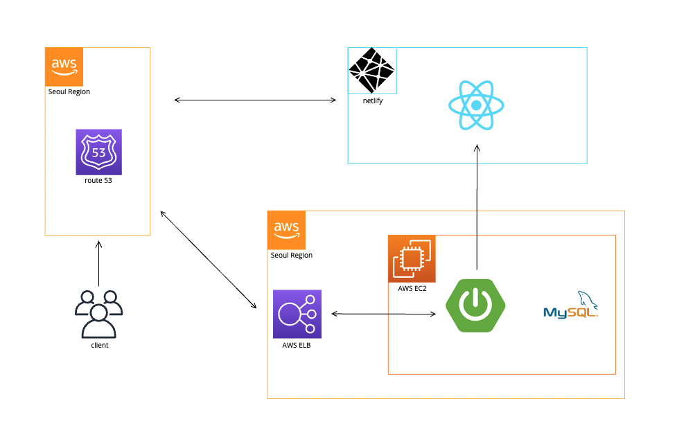

# 💡 JDON

원티드 JD, 인프런 강의, 그리고 네트워킹을 한 곳에서!

## 📌 프로젝트 소개

원티드 JD 기반의 인기있는 기술스택과 관련 인프런 강의 추천 서비스

자유로운 커피챗 커뮤니티 서비스

### 🔍️ JDON 미리 보기

[JDON 바로가기](https://jdon.kr) 👉🏻 https://jdon.kr

| 메인페이지                                                                                                                                 | 기술 스택 검색 페이지                                                                                                        |
|---------------------------------------------------------------------------------------------------------------------------------------|---------------------------------------------------------------------------------------------------------------------|
|                      |  |
| 원티드에서 크롤링 해온 기술스택 키워드를 기반으로   관련있는 인프런 인기 강의와 해당 기술에 관심을 가진 회사의 Job Description을 제공합니다.   JDON의 회원이 아니어도 해당 서비스를 제공받을 수 있습니다.  | 검색한 기술 키워드와 관련된 인프런 인기 강의와 해당 기술에 관심을 가진 회사의 Job Description을 제공합니다.   JDON의 회원이 아니어도 해당 서비스를 제공받을 수 있습니다.      |

| 커피챗 페이지                                                                                                       | 커피챗 상세 조회 페이지                                                                                                             |
|---------------------------------------------------------------------------------------------------------------|---------------------------------------------------------------------------------------------------------------------------|
|  |  |
| JDON 회원이 생성한 커피챗 목록을 확인할 수 있습니다. | JDON의 회원은 커피챗을 자유롭게 오픈할 수 있습니다.   커피챗을 오픈하기 위해서는 커피챗 진행 날짜, 시간, 모임 인원 그리고 커피챗 제목과 내용을 작성해야합니다.                         |

| 로그인 페이지                                                                                     | 마이페이지                                                                                     |
|---------------------------------------------------------------------------------------------|-------------------------------------------------------------------------------------------|
|  |  |
| JDON은 카카오와 깃헙을 통해서 로그인하실 수 있습니다.                                                            | 마이페이지에서는 내가 찜한 강의 목록, 신청한 커피챗 목록, 오픈한 커피챗 목록을 확인할 수 있습니다.                                 |

## 🗃️ 개발 기록
### ✨ 기술 스택

    
<strong>Backend</strong>

    

         
        
        
    

    
<strong>Database</strong>

    

        
        
        
    

    
<strong>Others</strong>

    

        
        
    

### 📦️ ERD

### 🏗️ Architecture 

### 📚️ 개발 기록
- [프로젝트 구조](docs/structure.md)
- [API 명세서](docs/api.md)
- trouble shooting
  - [멀티 모듈 도입하기]()
  - [oauth2 적용하기]()
  - [커피챗 신청에 동시성 고려하기]()
  - [인프런 크롤러 똑똑하게 만들기]()

## 👥 Contributors

<table>
  <tbody>
    <tr>
    <td align="center">
        <a href="https://github.com/yoonseon12">
          Leader  
          
            <b>yoonseon12</b> 
        </a>
    </td>
    <td align="center">
        <a href="https://github.com/aqrms">
           
          
           <b>aqrms</b>
        </a>
         
    </td>
    <td align="center">
        <a href="https://github.com/aacara">
           
          
           <b>aacara</b> 
        </a>
    </td>
    <td align="center">
        <a href="https://github.com/anso33">
           
          
           <b>anso33</b>
        </a>
         
    </td>
    </tr>
    <tr>
        <td align="center">
        <b>원티드 크롤링</b>
        </td>
        <td align="center">
        <b>커피챗 서비스</b>
        </td>
        <td align="center">
        <b>인프런 크롤링</b>
        </td>
        <td align="center">
        <b>로그인 서비스</b>
        </td>
    </tr>
  </tbody>
</table>

